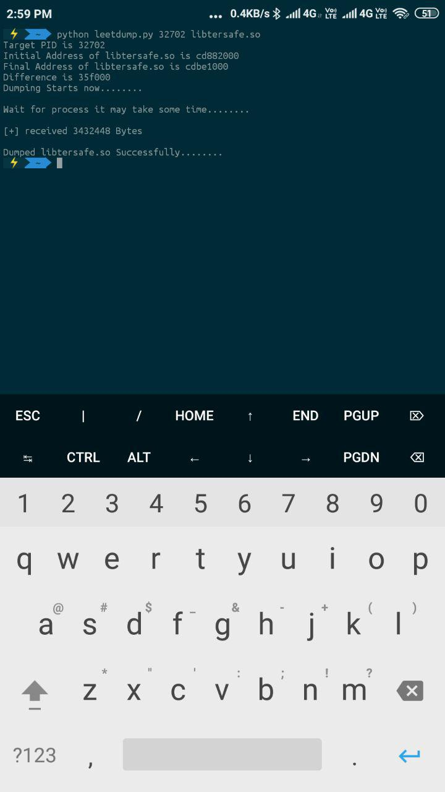

# leetdump
1337C001's Memory Dumper

# Prerequisite
1. Termux
2. Python Installed in Termux
- To install python use this command - pkg install python
3. tsu Installed in Termux
- To install tsu use this command - pkg install tsu

# Usage
1. find pid of main process using pidof command
- tsudo pidof com.tencent.ig (replace com.tencent.ig with your choice)
2. Run the dumper and follow the syntax below
- tsudo ./leetdump PID DROPLETNAME (Replace PID and DROPLET NAME)
# Example
For Example if you want to dump libtersafe.so from memory and PID of main pubg process id is 1234 then the command would be 
- tsudo ./leetdump 1234 libtersafe.so
# Note
- ~~This dumper writes Byte By Byte so it may take some time to dump the data if data size is heavy like 100s of MBs. I may update it later to support quick dumping.~~
- Updated the script to enable quick dumping. Please use python script. I will add the executable to releases soon.

